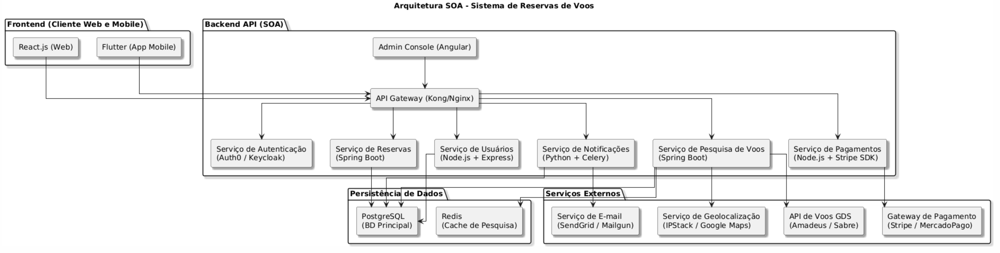

# Sistema de Reservas de Voos com Arquitetura SOA

## Visão Geral

Este projeto visa desenvolver um **Sistema de Reservas de Voos** moderno e escalável, adotando uma arquitetura orientada a serviços (SOA). O objetivo é permitir que usuários pesquisem, selecionem e reservem voos de forma eficiente, com integração a serviços externos que fornecem dados, funcionalidades e infraestrutura essenciais (como pagamentos, e-mail e localização).

## Justificativa da Arquitetura SOA

A opção por uma arquitetura SOA foi motivada pelas seguintes vantagens:

- **Desacoplamento de responsabilidades**: Cada módulo possui uma função clara e opera de forma independente, facilitando manutenção, testes e escalabilidade.
- **Reutilização e padronização**: Serviços como autenticação, pagamento e notificações podem ser reutilizados em diferentes contextos, inclusive por interfaces administrativas.
- **Integração facilitada com APIs externas**: Utilização de GDS (sistemas globais de distribuição), gateways de pagamento e serviços de geolocalização evita a necessidade de desenvolver funcionalidades do zero.
- **Escalabilidade horizontal**: Cada serviço pode ser replicado conforme a demanda.
- **Alta disponibilidade e tolerância a falhas**: Componentes distribuídos permitem que falhas em um módulo não derrubem o sistema inteiro.

### Componentes principais:

- **Frontend Web (React)** e **Mobile (Flutter)**: Interface amigável e responsiva para o usuário final.
- **API Gateway**: Centraliza e gerencia o acesso aos serviços internos, aplicando autenticação, logging e limitação de requisições.
- **Serviços internos (SOA)**:
  - Autenticação (Auth0 ou Keycloak)
  - Gestão de usuários
  - Pesquisa de voos com integração a APIs GDS
  - Processamento de reservas
  - Pagamentos integrados (Stripe ou MercadoPago)
  - Notificações assíncronas (e-mail via SendGrid)
- **Admin Console**: Interface para funcionários da companhia gerenciarem voos, assentos e dados dos clientes.
- **Persistência**: PostgreSQL (principal) e Redis (cache para buscas).
- **Serviços externos**: GDS (Amadeus, Sabre), SendGrid, Stripe, IPStack, entre outros.

---

## Requisitos Não Funcionais

Abaixo estão os principais requisitos não funcionais do sistema, com suas justificativas e relação com a arquitetura SOA:

### 1. **Escalabilidade**

- **Descrição**: O sistema deve escalar horizontalmente para atender a picos de demanda.
- **Justificativa**: Como cada serviço SOA é independente, é possível escalar apenas os que forem mais exigidos (ex: busca de voos) sem impactar os demais.

### 2. **Alta disponibilidade**

- **Descrição**: O sistema precisa estar disponível 24/7, especialmente em períodos críticos (como promoções ou feriados).
- **Justificativa**: A arquitetura distribuída permite replicação e uso de balanceadores de carga para garantir continuidade do serviço, mesmo com falhas parciais.

### 3. **Segurança**

- **Descrição**: Proteção de dados pessoais, informações de pagamento e acesso ao sistema.
- **Justificativa**: Utilização de OAuth2/OpenID com Auth0 ou Keycloak, além de comunicação HTTPS e isolamento dos serviços sensíveis (ex: pagamento).

### 4. **Desempenho**

- **Descrição**: O sistema deve apresentar tempos de resposta aceitáveis, especialmente na pesquisa de voos.
- **Justificativa**: Uso de Redis como cache para buscas, além de integração com GDS otimizados, garante respostas rápidas.

### 5. **Manutenibilidade**

- **Descrição**: O sistema deve ser fácil de manter, corrigir e evoluir.
- **Justificativa**: A arquitetura SOA favorece a manutenção modular, permitindo que cada serviço evolua de forma independente sem impactar o restante do sistema.

---

## Tecnologias Usadas

| Componente                 | Tecnologia                            | Motivo |
|---------------------------|----------------------------------------|--------|
| Frontend Web              | React.js                               | SPA rápida e moderna |
| App Mobile                | Flutter                                | Código único para Android/iOS |
| API Gateway               | Kong ou Nginx                          | Roteamento, autenticação, limites |
| Autenticação              | Auth0 ou Keycloak                      | SSO, JWT, segurança moderna |
| Serviços de Negócio       | Spring Boot / Node.js                  | Escalável, robusto e popular |
| Banco de Dados            | PostgreSQL                             | ACID, confiável e completo |
| Cache                     | Redis                                  | Rápido e eficiente para dados temporários |
| Notificações              | Celery + SendGrid                      | Tarefas assíncronas e envio de e-mails |
| Pagamentos                | Stripe ou MercadoPago                  | Confiável e seguro |
| Localização               | IPStack / Google Maps                  | Detecção de localização automática |
| GDS Voos                  | Amadeus, Sabre                         | Acesso ao inventário global de voos |

---

